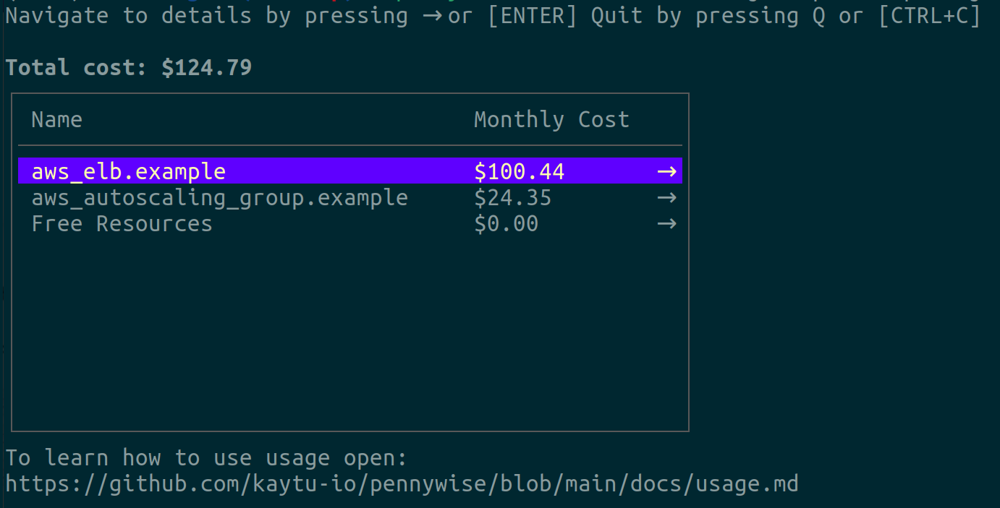

<h1 align="center"> Pennywise </h1>

<p align="center">
    
    
    
    
</p>

## Overview
Pennywise estimates the cost of cloud infrastructure before the actual deployment by analyzing Terraform and OpenTofu plan files. The current version supports commonly used [AWS resources](https://github.com/kaytu-io/pennywise/blob/main/docs/aws-support.md) and [Azure resources](https://github.com/kaytu-io/pennywise/blob/main/docs/azure-support.md).


## Getting Started

### 1. Install CLI

**Linux/MacOS**
```shell
curl -fsSL https://kaytu.s3.amazonaws.com/pennywise/install.sh | sh
```

**Windows**

Download and install manually from [releases](https://github.com/kaytu-io/pennywise/releases) 

### 2. Sign-up / Login

Sign-up & Login for free using:

```shell
pennywise login
``` 

this command will give you a link to open in your browser to help you sign-up and login into your kaytu account.

### 3. Generate Terraform Plan

Navigate to your Terraform folder and generate the Terraform plan (you need terraform and jq installed to do this)

```shell
# You can try out our sample if you wish: git clone https://github.com/kaytu-io/sample-terraform.git
# cd sample-terraform

terraform init
terraform plan -out tfplan.binary
terraform show -json tfplan.binary > tfplan.json
```

### 4. Get costs

Run the following in the directory containing your terraform plan:

```shell
pennywise cost --json-path tfplan.json
```



You can also specify the usage file which provides additional information for cost estimation.
The usage file is supported in two types: `json` and `yaml`

````json
{
  "azurerm_virtual_machine.windows": {
    "monthly_os_disk_operations": 1000000,
    "monthly_data_disk_operations": 2000000
  },
  "azurerm_virtual_machine.linux_withMonthlyHours": {
    "monthly_hrs": 100
  },
  "azurerm_virtual_machine.windows_withMonthlyHours": {
    "monthly_hrs": 100
  }
}
````

Use the usage file to optimize the cost estimation:

```shell
pennywise cost terraform --json-path tfplan.json --usage usage.json
```

Supported usage parameters of each resource type are available here:\
[aws-usage](./docs/aws-usage-parameters.md)\
[azure-usage](./docs/azure-usage-parameters.md)

To get a more detailed documents on CLI options and commands, please refer to [docs](./docs/pennywise.md)

## Contributing
Please read [CONTRIBUTING.md](CONTRIBUTING.md) for details on our code of conduct, and the process for submitting pul requests to us.

## License
This project is licensed under the Apache License Version 2.0 - see the [LICENSE](LICENSE) file for details.
